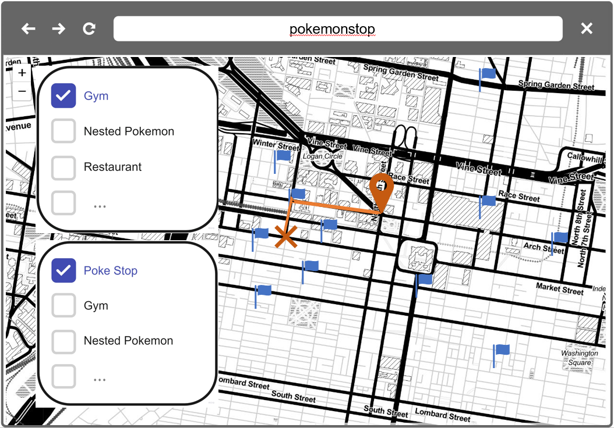

# MUSA 611 Final Project Template

## Project Proposal

### PokemonStay

### Author

Ziyuan Cai

### Abstract

For Pokémon players, in an unfamiliar place, it is impossible to judge where to go to catch Pokémon safer and faster only based on the information from the AR map in the game. So, I want to build a website to solve this task and focus on Philadelphia first. Where should people new to Philadelphia go to get Pokémon faster and safer? Now, the most mature player assistant is the Pogomap website (The link is the first one in the data section). This website records all the Pokéstops in the game and contains user interface that can be updated timely, which is the most similar to the project I try to complete.

### Data

|     Source     |            Name            |                             Url                              | Geometry Type |
| :------------: | :------------------------: | :----------------------------------------------------------: | :-----------: |
| OpendataPhilly |           Crime            | [Crime](https://www.opendataphilly.org/dataset/crime-incidents) |    Point    |
|    Pogomap     |       Poké Stop data       | [Pogomap](https://www.pogomap.info/) |    Point    |
| OpenStreetMap  |           Road             | [Road](https://www.openstreetmap.org/relation/188022)|    Polygon    |
| OpenStreetMap  |           Food             | [Food](https://www.openstreetmap.org/relation/188022) |    Point     |
| OpenStreetMap  |           Drink            | [Drink](https://www.openstreetmap.org/relation/188022) |    Point     |
| OpenStreetMap  |          Bus Stop          | [Bus Stop](https://www.openstreetmap.org/relation/188022) |    Point     |

### Wireframes 

### Deliverable

I want to build a dashboard to show my results. After entering the website, users will first mark their location on the map, and then, in the filter window, select the factors they want to take into account such as whether to include Gyms or anywhere to drink. Based on the user's choice, the site will provide suggested destinations and routes to go along with some game-related tips.

### Website

[Pokemon Stay](https://krmeteor.github.io/Pokemon-Stay/)